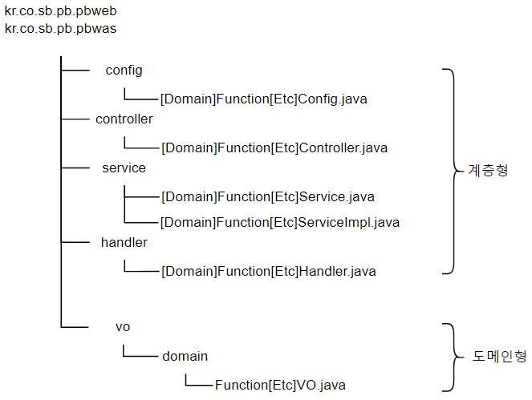

# 2. 프로젝트 구조 및 package

## 2.1. 개요

PB(Practical Backend) 프로젝트에서 사용할 gradle project의 구성과 사용할 package에 대한 convention에 대해 기술한다.

## 2.2. 모듈

Project에서 사용할 Build Tool 인 `Gradle`은 `MAVEN`과 달리 Multi-Project 형식이 아닌 단일 Project 내에 Sub Module을 생성하여 관리한다.
모든 Project와 Module의 이름은 영어 소문자로만 구성한다.

### 2.2.1. 구조

Gradle Project의 Multi-Modules는 아래와 같은 형식으로 구성이 될 수 있다.  
(_모든 이름은 가칭_)

* Main Project(PB)
  + PBWEB
  + PBWAS
  + COMMON
  + DAL
  + _TBD(기타 필요한 모듈)_

### 2.2.2. Main Project

Main Project는 모든 하위 모듈이 포함하기 위해 일반 Gradle Project로 생성한다.

Project를 생성하기 앞서 Project의 Group ID, Artifact ID, Version에 대한 정의가 필요하다.

- Group ID
  
  - 프로젝트를 구분하는 유일한 식별 값
  
  - 주로 회사 도메인의 역순으로 정의
  
  - 임시로, Group ID는 <mark>kr.co.sb.pb</mark>와 같이 정의한다.

- Artifact ID
  
  - 사전적 의미로 가공품, 인공품, 인공 유물 즉 직접 만든 <mark>무엇</mark>을 의미한다.
  
  - Project가 빌드된 후 생성되는 <mark>JAR</mark> 파일의 이름으로, project 자체 이름으로 명명한다.
  
  - 영어 소문자와 <mark>-</mark> (dash)로 명명하는 것을 추천한다.
  
  - 의미적으로 직관적인 단어나 통용되는 약자로 구성하는 것을 추천한다.

- Version
  
  - 일반적인 버전의 명명 규칙을 사용한다.
  
  - 숫자와 <mark>.</mark> (dot)로 구성하는 것을 추천한다.
  
  - Project 생성시 자동으로 부여되는 <mark>SNAPSHOT</mark> 은 배포시 하용하지 않는것을 권장한다.
  
  - 버전에 <mark>날짜</mark>를 부여하지 않는다.

위와 같은 정의를 기준으로 pb의 project 설정은 아래와 같다.

- Group ID : `kr.co.sb.pb`

- Artifact ID : `pb`

- Version : 0.0.1

### 2.2.3. PBWEB Module

PBWEB **P**ractical **B**ackend **WEB** server의 약자로 front-end을 담당한다.

위 Project의 Group ID, Artifact ID, Version 정의에 따라 Module의 설정은 아래와 같이 구성할 수 있다.

- Group ID : `kr.co.sb.pb`

- Artifact ID : `pbweb`

- Version : Main Project의 Version 상속 또는 자체 version 기술

### 2.2.4. PBWAS Module

PBWAS은 **P**ractical **B**ackend **WAS** server의 약자로 back-end을 담당한다.

위 Project의 Group ID, Artifact ID, Version 정의에 따라 Module의 설정은 아래와 같이 구성할 수 있다.

- Group ID : `kr.co.sb.pb`

- Artifact ID : `pbwas`

- Version : Main Project의 Version 상속 또는 자체 version 기술

### 2.2.5. Common Module

Common Module은 Project 내의 모든 Module에서 공통적으로 사용할 수 있는 각종 Utilities의 모음이다.

위 Project의 Group ID, Artifact ID, Version 정의에 따라 Module의 설정은 아래와 같이 구성할 수 있다.

- Group ID: `kr.co.sb.pb`
- Artifact ID: `common`
- Version:  Main Project의 Version 상속 또는 자체 version 기술

### 2.2.6. DAL Module

DAL Module은 **D**ata **A**ccess **L**ayer의 약자로 `Database`의 각종 `데이터`를 일관성 있게 제공해주는 역할을 한다.

`DAL`은 `Persistence Framework`를 이용하여 구성할 수 있다.

- `ORM`
- **O**bject **R**elational **M**apping의 약자
- Database(Table / Columns) <--> Mapping <--> Object(POJO / Fields)
- Object와의 관계성으로 SQL 자동 생성
- Database Engine에 비 종속적
- 대표적 Persistence로는 `Hibernate`
- `SQL Mapper`
- SQL <--> Mapping <--> Object(POJO / Fields)
- SQL내의 정의와 POJO의 관계를 별도로 정의
- 복잡하거나 세밀한 작업이 가능
- 대표적 Mapper로는 `MyBatis`

위 Project의 Group ID, Artifact ID, Version 정의에 따라 Module의 설정은 아래와 같이 구성할 수 있다.

* Group ID: `kr.co.sb.pb`
* Artifact ID: `dal`
* Version:  Main Project의 Version 상속 또는 자체 version 기술

## 2.3. PB Project

### 2.3.1. Project 및 Module 생성

1) IntelliJ IDEA 실행 화면
   
   > |  |
   > |:----------------------------------------:|
   > |     < 그림 2.3.1.-1 : IntelliJ 실행 화면 >     |
   > 
   > - 왼쪽 영역의 `Projects` 을 클릭
   > - 메인 화면의 `New Project`를 클릭
   > - 프로젝트 생성 화면 열기

2) New Project 화면

> |  |
> |:------------------------------------------------:|
> |        < 그림 2.3.1.-2 : 신규 Project 설정 화면 >        |
> 
> - Name : 2.2.2 절에서 정의한 Main Project 이름인 `pb`를 입력한다.
> - Language는 `Java`를 선택한다.
> - Build system : `Gradle`를 선택한다.
> - JDK : 설치되어 있는 JDK Version 중 17을 선택한다.
> - Gradle DSL : `Groovy`를 선택한다.
> - Advanced Setting - GroupId : 2.2.2 절에서 정의한 Main Project Group Id인 `kr.co.sb.pb`를 입력한다.
> - Advanced Setting - ArtifactId : 2.2.2 절에서 정의한 Main Project ArtifactId인 `pb`를 입력한다.
> - Create 버튼을 클릭하여 Main Project를 생성한다.

3) Sub Module 생성 

Main Project 가 생성이 되었으면 `Sub Module`을 생성한다.
`Sub Module`은 `common` Module을 제외하고는 모두 `Spring boot` Project로 생성할 것이다.
`common` Module은 각 단위 Module에서 공통적으로 사용 가능한 각종 유용한 기능들의 집합이므로 일반 `Java Project`로 생성할 것이다.

2가지 유형-`Java Project`, `Spring Boot Project`의 Module을 생성하기 위해

- `IntelliJ` 이용
- `Spring Initializer` 이용

위 2가지 방법으로 진행할 것이다.  
`IntelliJ`를 이용한 방법은 위 Main Project를 생성하는 방법과 동일하다.

`Spring Initializer`를 이용한 방법은 2가지로 나뉘다.

- `IntelliJ`의 `Plugin`을 이용
- `Spring Boot Starter` 사이트 이용

`IntelliJ` IDE의 `Plugin`은 `IntelliJ` 상용버전에서 지원하며, `Community`버전에서는 지원하지 않는다.
그러므로 현재 개발 환경인 `IntelliJ Commnunity`에서는  `Spring Boot Starter` 사이트를 이용할 것이다.

> |  |
> |:---------------------------------------:|
> |     < 그림 2.3.1.-3 : Module 생성 화면 >      |
> 
> - 마우스를 `pb` 프로젝트에 가져가서 왼클릭한 다음 우클릭으로 `Context Menu`를 확장한다.
> - `Context Menu`에서 `New`를 선택
> - `Module`를 클릭

> |  |
> |:---------------------------------------:|
> |   < 그림 2.3.1.-4 : Sub Module 설정 화면 >    |
> 
> - 왼쪽 영역의 `New Module` 을 클릭 
> - `Language`, `Build system`, `JDK`, `Gradle DSL`은 Main Project 생성시와 동일하게 선택한다.
> - Name : 각 모듈의 이륨을 소문자로 입력한다(2.2.2 ~ 2.2.6).
> - Advanced Setting - GroupId : 2.2.2 ~ 2.2.6 절에서 정의한 Group Id인 `kr.co.sb.pb`를 입력한다.
> - Advanced Setting - ArtifactId : 2.2.2 ~ 2.2.6 절에서 정의한 ArtifactId를 입력한다.

pb project를 위한 모든 sub module을 생성한 화면은 아래 <그림 2-5 : pb project >과 
같이 pbweb/pbwas, common, dal 모듈이 생성된것을 확인 할 수 있다.

> |  |
> |:------------------------------------------------:|
> |          < 그림 2.3.1.-5 : pb project >          |

> |  |
> |:------------------------------------------------:|
> |      < 그림 2.3.1.-6 : pb project 초기 파일들 >       |

pb project의 Main Project는 단지 sub module들을 관리만 할 것이기 때문에 
`src` 폴더는 삭제 한다. 또한 sub module을 생성하면서 각 모듈 아래에 생성된 `.gitignore`도 삭제한다.

> |  |
> |:--------------------------------------------------:|
> |       < 그림 2.3.1.-7 : pb project 삭제 후 상태 >       |

### 2.3.2 build.gradle 설정

이제 Main Project및 각 모듈의 build.gradle의 내용 우리가 원하는 바대로 빌드되도록 설정파일을 변경한다.

- Main Project build.gradle 수정
  
  Main Project의 build.gradle은 하위 module들에 공통으로 적용되는 사항을 기술한다. 

```agsl
plugins {
    id 'java'
    id 'org.springframework.boot' version '3.1.1'
    id 'io.spring.dependency-management' version '1.1.0'
}

repositories {
    mavenCentral()
}

bootJar.enabled = false

subprojects {
    group = 'kr.co.sb.pb'
    version = '0.0.1'
    sourceCompatibility = '17'

    apply plugin : 'java'
    apply plugin : 'java-library'
    apply plugin : 'org.springframework.boot'
    apply plugin : 'io.spring.dependency-management'

    configurations {
        compileOnly {
            extendsFrom annotationProcessor
        }
    }

    repositories {
        mavenCentral()
    }
}

project(':common') {
    bootJar {
        enabled = false
    }
}

project(':dal') {
    bootJar {
        enabled = false
    }
}
```

- common build.gradle 수정

```agsl
plugins {
    id 'java'
}

group = 'kr.co.sb.pb'
version = '0.0.1'

dependencies {
    /* Core starter, including auto-configuration support, logging and YAML */
    implementation 'org.springframework.boot:spring-boot-starter'

    /* Jackson - JSON Data binding */
    implementation 'com.fasterxml.jackson.core:jackson-databind:2.13.1'

    /* Jackson - CSV Format*/
    implementation 'com.fasterxml.jackson.dataformat:jackson-dataformat-csv:2.13.1'

    /* Apache common IO - File Monitoring */
    implementation 'commons-io:commons-io:2.11.0'

    /* JSch is a pure Java implementation of SSH2 */
    implementation 'com.jcraft:jsch:0.1.55'

    /* lombok */
    compileOnly 'org.slf4j:slf4j-site:1.7.28'

    /* Servlet */
    compileOnly 'javax.servlet:javax.servlet-api:4.0.1'

    /* Apache Http Client  */
    implementation 'org.apache.httpcomponents:httpclient'
}
```

- dal build.gradle

```agsl
buildscript {
    ext {
        queryDslVersion = '5.0.0'
    }
}

plugins {
    id 'java'
    id 'com.ewerk.gradle.plugins.querydsl' version '1.0.10'
}

group = 'kr.co.sb.pb'
version = '0.0.1'

dependencies {
    /* Developer Tools */
    developmentOnly 'org.springframework.boot:spring-boot-devtools'

    implementation 'org.jetbrains:annotations:24.0.0'

    compileOnly 'org.projectlombok:lombok'
    annotationProcessor 'org.projectlombok:lombok'

    /* Spring Boot Configuration */
    annotationProcessor 'org.springframework.boot:spring-boot-configuration-processor'

    /* Security */
    implementation 'org.springframework.boot:spring-boot-starter-security'


    /* Cache - ehCache will be used */
    implementation 'org.springframework.boot:spring-boot-starter-cache'

    /* Database - ORM - JPA */
    implementation 'org.springframework.boot:spring-boot-starter-data-jpa'
    implementation "com.querydsl:querydsl-jpa:${queryDslVersion}"
    implementation "com.querydsl:querydsl-apt:${queryDslVersion}"

    annotationProcessor "com.querydsl:querydsl-apt:${queryDslVersion}"


    /* SQL */
    implementation 'org.springframework.boot:spring-boot-starter-data-jdbc'
    implementation 'org.springframework.boot:spring-boot-starter-jdbc'

    /* Database - ORM - MyBatis */
    implementation 'org.mybatis.spring.boot:mybatis-spring-boot-starter:2.3.1'

    /* Database -Logging */
    implementation 'org.bgee.log4jdbc-log4j2:log4jdbc-log4j2-jdbc4.1:1.16'

    /* Database - Driver - MySql */
    runtimeOnly 'com.mysql:mysql-connector-j'

    /* yml 암호화 */
    implementation 'com.github.ulisesbocchio:jasypt-spring-boot-starter:3.0.4'

    /* Jackson databind */
    implementation 'com.fasterxml.jackson.core:jackson-databind'

    // Test
    testImplementation 'org.projectlombok:lombok'
    testCompileOnly 'org.projectlombok:lombok'
    testAnnotationProcessor 'org.projectlombok:lombok'
    testImplementation 'org.springframework.boot:spring-boot-starter-test'
}

def querydslDir = '$buildDir/generated/querydsl'

querydsl {
    jpa = true
    querydslSourcesDir = querydslDir
}

sourceSets {
    main.java.srcDir querydslDir
}

configurations {
    compileOnly {
        extendsFrom annotationProcessor
    }
    querydsl.extendsFrom compileClasspath
}

compileQuerydsl {
    options.annotationProcessorPath = configurations.querydsl
}

```

- pbweb build.gradle

```agsl
plugins {
    id 'java'
}

group = 'kr.co.sb.pb'
version = '0.0.1'

dependencies {

}
```

- pbwas build.gradle

```agsl
plugins {
    id 'java'
}

group = 'kr.co.sb.pb'
version = '0.0.1'

dependencies {

}
```

## 2.4. Package 및 Folder 구조

package는 2.2.에서 정의 Project 구조를 기본적으로 따른다. 즉, `groupid`와 `artifactid`를 기본으로 package를 정의 한다. 

### 2.4.1. PB 전체 Package 구조

Package의 이름은 java name convention에 따라 모두 <mark>영어 소문자</mark>로만 구성한다.

pb프로젝트에서는 계층형 + 도메인형 조합으로 사용할 예정이며, 기본적인 구성은 아래 < 그림 2.4.1.-1 : pb package 구조 >와 같다.

>|  |
>|:-----------------------------------------:|
>|     < 그림 2.4.1.-1 : pb package 구조 >     |
>- config
>  
>  Project에 공통적으로 적용되는 설정에 대한 package
>
>- controller
>  
>  웹으로 제공할 페이지들의 Controller 및 RestController들의 package 
>
>- service
>  
>  각종 로직이 들어 있는 service들의 interface/implement package
>
>- handler
>  
>  pb에서 필요한 각종 handler들의 package
>
>- dao
>  
>  SQL Mapper인 MyBatis를 이용할 경우 Data Access Object들의 package
>
>- dto
>  
>  SQL Mapper인 MyBatis를 이용할 경우 Data Transfer Object들의 package
>
>- entity
>  
>  Persistence인 Hibernate를 이용할 경우 Data Entity Object들의 package
>
>- repository
>  
>  Persistence인 Hibernate를 이용할 경우 Data Access Object들의 package
>
>- vo
>  
>  웹에서 제공하는 HTML page 및 REST API에 전달할 Pojo들의 package
>
>- common
>  
>  프로젝트에서 공통적으로 사용될 수 있는 utility의 package

1) common module package 구조

>|  |
>|:--------------------------------------------------:|
>|     < 그림 2.4.1.-2 : common module package 구조 >     |


2) dal module package 구조

>|  |
>|:-----------------------------------------------:|
>|     < 그림 2.4.1.-3 : dal module package 구조 >     |


3) pbweb/pbwas module package 구조

>|          |
>|:---------------------------------------------------------:|
>| < 그림 2.4.1.-4 : pbweb/pbwas module package 구조 > |


### 2.4.2. Folder 구조

#### 2.4.2.1. Spring Boot - General Project

아래는 일반적인 `Gradle`의 `Spring Boot Project`의 구조예시이다.

```bash
{project}
├─ build
├─ src
│   └─ main
│      └─ java
│         └─ {package}
│      └─ resources
│   └─ test
│      └─ java
│         └─ {package}
│      └─ resources
```

* build
  
  이 폴더는 `build.gradle`로 `build`를 수행하였을 때 생성되는 각종 `class`또는 설정 파일을 저장하고 배포할 수 있는 `jar`/`war`를 생성하는 폴더 이다.

* src
  
  이 폴더는 `Project`에서 생성하는 각 `Source Code`를 저장하는 폴더이다.
  
  + main
    
    이 폴더는 실제 빌드되는 `Java Source Code`와 설정 파일등이 저장되는 폴더이다.
    
    - java
      
      `Projet`의` Package`에 따라 폴더가 생성되고` Jav Source Code` 가 저장된다.
      
      - {package}
        
        `Projet`의` Package` 경로이다.
    
    - resources
      
      `Projet`의 설정 파일들이 저장된다. 기본적으로 `application.yml`이 저장되는 폴더이다.
+ test
  
  이 폴더는 `Project`에서 테스트를 위한 폴더이며 `main`폴더와 같은 구조를 가진다.
  
  - java
    - {package}
  - resources

#### 2.4.2.2. Spring Boot - Presentation Project

`Gradle`의 `Spring Boot`용 `Presentation Project`는 일반적인 구조와 동일하나 `resources` 폴더 아래에 `static`과 `templates` 폴더가 추가된다.
아래는 `Presentation Project`의 구조 예시이다.

```bash
{project}
├─ build
├─ src
│   └─ main
│      └─ java
│         └─ {package}
│      └─ resources
│            └─ {application.yml}
│            └─ static
│               └─ common
│                  └─ css
│                  └─ js
│               └─ images
│            └─ templates
│               └─ fragments
│               └─ layout
│               └─ view
│                  └─ {menu}
│   └─ test
│      └─ java
│         └─ {package}
│      └─ resources
```

추가된 폴더의 설명은 아래와 같다.

* static
  `Thymeleaf`를 이용한 `Presentation`을 구현할 경우 생성을 한다.
  `Presentation`에서 `static`은 정적인 데이터 즉 `HTML`과 관련된 파일을 저장하는 곳이다.
  
  + common
    
    `common`은 공통적으로 사용할 수 있는 파일들을 저장하는 폴더이다. 공통적으로 쓰일수 있는 유형으로는 `css`, `Java Script`이 있을 수 있다.
    
    - css
      
      HTML에서 사용하는 각종의 `css`를 저장한다.
    
    - js
      
      HTML에서 사용하는 각종의 `Java Script`를 저장한다.
  
  + images
    
    `Presentation`의 `HTML` 또는 `css`가 사용하는 고정된 이미지들을 저장한다. 동적 생성되는 이미지들은 별도의 `Name Convention`으로 별도의 `Storage`에 저장한다.

* templates
  
  `Thymeleaf`를 사용할 경우 `Template`이 위치하는 경로이다.
  
  + fragments
  
  `Thymeleaf`의 `Layout`을 사용할 경우 `Layout`은 단위 `Fragment` - 공통의 작은 영역 - 단위로 구성되며 각종의 `Fragment`가 저장되는 폴더이다.
  
  + layout
    
     `Thymeleaf`의 `Template`을 구성하는 `Layout`을 정의하는 `HTML`이 저장되는 폴더이다.
  
  + view
    
    `Thymeleaf`의 `Layout`으로 구성한 `Template`의 실제 화면 `HTML`이 존재하는 폴더이다.

